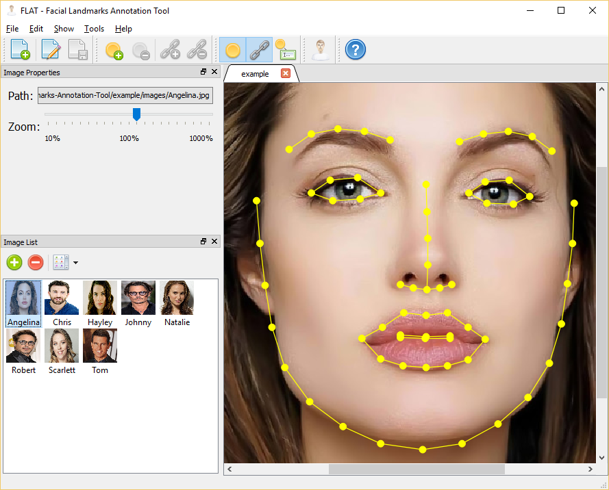

# FLAT - Facial Landmarks Annotation Tool

A visual editor for manually annotating facial landmarks in images of human faces.

## Usage

Create a new face annotation dataset (files with extension `.fad`) and add the face images. Then, add the facial features and connect then as desired using either the program menus or the context menu. The zoom level can be controlled either from the widget control on the image properties tool window or by holding CTRL and scrolling the mouse wheel. While zoomed, an image can also be side scrolled by holding SHIFT and scrolling the mouse wheel. All images in the same face annotation dataset share the same model, that is they have the same amount of face landmarks (even though they can be differently positioned for each image). Automatically fitting of 66 face landmarks can be performed via the "Fit Landmarks" option if the utility is available (see details bellow). If the automatic fitting succeeds, the 66 landmarks will be positioned as best as possible in the face image. Otherwise, a status bar message will indicate the error.

## Dependences

The application has been developed and tested with:

- [CMake](https://cmake.org/) 3.5.0-rc3
- [Qt](http://www.qt.io/) 5.5.1 32-bit

The "Fit Landmarks" menu option (in "Tools/CSIRO Face Analysis SDK" menu) requires an external executable called `fit-fit(.exe)` - even though its absence does not prevent the FLAT tool from being compiled and used. Please check the [SDK web site](http://face.ci2cv.net/) and [the source code of my port to Windows/Linux](https://github.com/luigivieira/face-analysis-sdk). The option for an external dependence (instead of source code integration) is only to make the compilation of this project simpler and its usage broader.

## Building

1. Use CMake to configure and generate the environment. I suggest using the folder `build`, since it is the one ignored by gitignore.
2. In Windows, open the Visual Studio solution and build with the desired build type (*debug*, *release*, etc).
3. In Linux, use type `make` to let the Makefile produce the binary in the build type configured by CMake.
4. The code produces only a single executable named `flat(.exe)`, that depends only on Qt. If you want to use the "Fit Landmarks" option mentioned before, go to the CSIRO Face Analysis SDK page, download and build its libraries and executables. Then, configure in FLAT the path for the `face-fit(.exe)` executable.

## Credits

Copyright (C) 2016 [Luiz Carlos Vieira](http://www.luiz.vieira.nom.br). Available under GPL (see details in the license file).

The application icons and images are either from or based on the Oxygen Icons Set, downloaded as [PNGs from Felipe Azevedo (pasnox)](https://github.com/pasnox/oxygen-icons-png) and [licensed under LGPL from KDE](https://techbase.kde.org/Projects/Oxygen/Licensing), and the [Farm-Fresh Web Icons Set](http://www.fatcow.com/free-icons), licensed under [Creative Commons (CC BY 4.0)](http://creativecommons.org/licenses/by/4.0/).